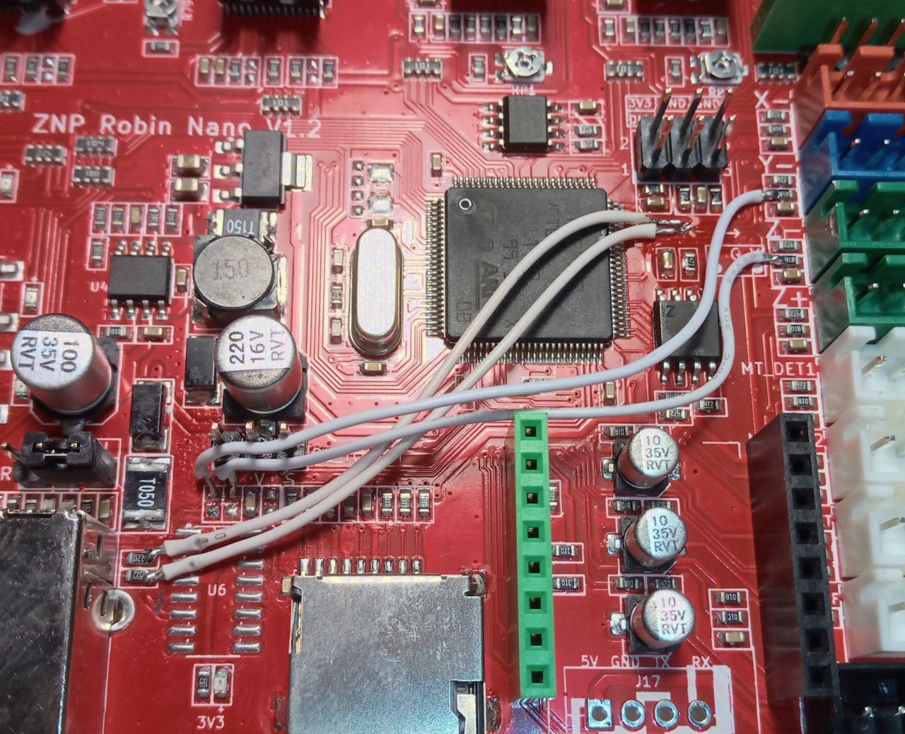

### Modifying ZNP Nano v1.x for Native USB

#### Why?

STM32F103/F407 have native USB capabilities, but this board uses a CH340 USB-serial bridge that greatly limits communication speed (realistically, no more than 250kbps), increasing the chance of communication errors and dropped bytes. This is most critical when using Octoprint or other host software. Native USB-CDC mode communicates at much greater speeds (in our case around 1.5Mbps), drastically reducing the chance of communication timeout and/or buffer overrun.

#### How?

1. Cut two traces near the CH340 chip (1), two going to endstops (2) and remove two resistors (3) as shown. Scratch off some of the mask from the traces on the microcontroller side (2). You can also remove the CH340 if you want.

2. Solder wires as shown, making sure the new USB wires (below) are exactly the same length and group closely together. Use the thinnest insulated / lacquered wires you can find (the photo shows the thickest possible). The wires used in laptop screens are ideal.

3. Add a 1.5kΩ pullup resistor for the D+ signal as shown:

4. Set `default_envs` to `mks_robin_nano_v1v2_usbmod` or `mks_robin_nano_v1_3_f4_usbmod` in `platformio.ini`. Add/uncomment `USB_MOD` in `Configuration.h` and build Marlin.
