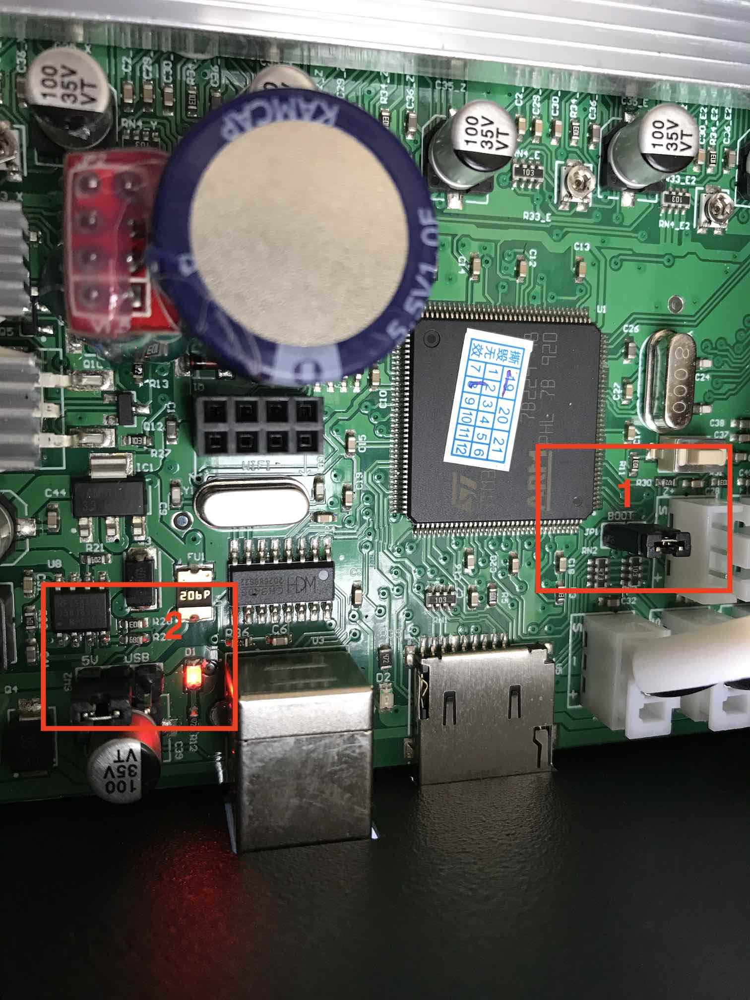

# Before start (Optional, but recommended)

You can (OR MUST) dump the current settings of your printer. It may help you to figure out some configs, like steps/mm of your extruder.

1. Create a file named ``savesettings.gcode`` with the followig content:
```
M6046 ;sdcard access
M8512 "currentconfig.gcode" ;save settings to file
```
2. Save it in your printer SD
3. Put it on your printer and "print" this file
4. The printer won't do anything, just wait a few seconds and stop the print.
5. Your current printer settings are stored in the file: ``currentconfig.gcode``

You can read more about in: https://www.facebook.com/notes/tronxy-turnigy-x5s-x5sa-x3s-3d-printer-drucker-users/tronxy-firmware-configuration-guide-by-keith-varin-addermk264bit-tuning/649799805579765/

Thanks to KEITH VARIN.

# Configuring your board

In the Configuration.h you can change board to V5, V6, and so on.

### 1. Check your board ``#define MOTHERBOARD `` part
### 2. Check your bed size:
```cpp
// The size of the print bed
#define X_BED_SIZE 330
#define Y_BED_SIZE 330
...
#define Z_MAX_POS 400
```
### 3. Check your drivers. Some PRO have TMC drivers. The non pro have generic A4988 ones:
Non-Pro:
```cpp
/**
 * Stepper Drivers
 *
 * These settings allow Marlin to tune stepper driver timing and enable advanced options for
 * stepper drivers that support them. You may also override timing options in Configuration_adv.h.
 *
 * A4988 is assumed for unspecified drivers.
 *
 * Options: A4988, A5984, DRV8825, LV8729, L6470, L6474, POWERSTEP01,
 *          TB6560, TB6600, TMC2100,
 *          TMC2130, TMC2130_STANDALONE, TMC2160, TMC2160_STANDALONE,
 *          TMC2208, TMC2208_STANDALONE, TMC2209, TMC2209_STANDALONE,
 *          TMC26X,  TMC26X_STANDALONE,  TMC2660, TMC2660_STANDALONE,
 *          TMC5130, TMC5130_STANDALONE, TMC5160, TMC5160_STANDALONE
 * :['A4988', 'A5984', 'DRV8825', 'LV8729', 'L6470', 'L6474', 'POWERSTEP01', 'TB6560', 'TB6600', 'TMC2100', 'TMC2130', 'TMC2130_STANDALONE', 'TMC2160', 'TMC2160_STANDALONE', 'TMC2208', 'TMC2208_STANDALONE', 'TMC2209', 'TMC2209_STANDALONE', 'TMC26X', 'TMC26X_STANDALONE', 'TMC2660', 'TMC2660_STANDALONE', 'TMC5130', 'TMC5130_STANDALONE', 'TMC5160', 'TMC5160_STANDALONE']
 */
#define X_DRIVER_TYPE  A4988
#define Y_DRIVER_TYPE  A4988
#define Z_DRIVER_TYPE  A4988
//#define X2_DRIVER_TYPE A4988
//#define Y2_DRIVER_TYPE A4988
//#define Z2_DRIVER_TYPE A4988
//#define Z3_DRIVER_TYPE A4988
//#define Z4_DRIVER_TYPE A4988
#define E0_DRIVER_TYPE A4988
//#define E1_DRIVER_TYPE A4988
//#define E2_DRIVER_TYPE A4988
//#define E3_DRIVER_TYPE A4988
//#define E4_DRIVER_TYPE A4988
//#define E5_DRIVER_TYPE A4988
//#define E6_DRIVER_TYPE A4988
//#define E7_DRIVER_TYPE A4988
```
Pro:
```cpp
/**
 * Stepper Drivers
 *
 * These settings allow Marlin to tune stepper driver timing and enable advanced options for
 * stepper drivers that support them. You may also override timing options in Configuration_adv.h.
 *
 * A4988 is assumed for unspecified drivers.
 *
 * Options: A4988, A5984, DRV8825, LV8729, L6470, L6474, POWERSTEP01,
 *          TB6560, TB6600, TMC2100,
 *          TMC2130, TMC2130_STANDALONE, TMC2160, TMC2160_STANDALONE,
 *          TMC2208, TMC2208_STANDALONE, TMC2209, TMC2209_STANDALONE,
 *          TMC26X,  TMC26X_STANDALONE,  TMC2660, TMC2660_STANDALONE,
 *          TMC5130, TMC5130_STANDALONE, TMC5160, TMC5160_STANDALONE
 * :['A4988', 'A5984', 'DRV8825', 'LV8729', 'L6470', 'L6474', 'POWERSTEP01', 'TB6560', 'TB6600', 'TMC2100', 'TMC2130', 'TMC2130_STANDALONE', 'TMC2160', 'TMC2160_STANDALONE', 'TMC2208', 'TMC2208_STANDALONE', 'TMC2209', 'TMC2209_STANDALONE', 'TMC26X', 'TMC26X_STANDALONE', 'TMC2660', 'TMC2660_STANDALONE', 'TMC5130', 'TMC5130_STANDALONE', 'TMC5160', 'TMC5160_STANDALONE']
 */
#define X_DRIVER_TYPE  TMC2208_STANDALONE
#define Y_DRIVER_TYPE  TMC2208_STANDALONE
#define Z_DRIVER_TYPE  TMC2208_STANDALONE
//#define X2_DRIVER_TYPE A4988
//#define Y2_DRIVER_TYPE A4988
//#define Z2_DRIVER_TYPE A4988
//#define Z3_DRIVER_TYPE A4988
//#define Z4_DRIVER_TYPE A4988
#define E0_DRIVER_TYPE TMC2208_STANDALONE
//#define E1_DRIVER_TYPE A4988
//#define E2_DRIVER_TYPE A4988
//#define E3_DRIVER_TYPE A4988
//#define E4_DRIVER_TYPE A4988
//#define E5_DRIVER_TYPE A4988
//#define E6_DRIVER_TYPE A4988
//#define E7_DRIVER_TYPE A4988
```

### 4. Configure the steps

I think all machine have the same steps for X, Y and Z, and only extruder step is diferrent (titan and normal).

***!!! THIS PART CAN CHANGE MACHINE TO MACHINE !!!***

I way to know the corret values is to see in your ``currentconfig.gcode`` saved latter:
``M8009`` is the X and Y step/mm.
``M8010`` is the Z step/mm.
``M8011`` is the Extruder step/mm.
Example:
```
M8009 S0.012500;x,y
M8010 S0.002500;z
M8011 S0.010799;e
```
Is equal to:
```
x,y = 1 / 0.012500 = 80
z = 1 / 0.002500 = 400
e = 1 / 0.010799 = 92.60
```
so in marlin:
```cpp
#define DEFAULT_AXIS_STEPS_PER_UNIT   { 80, 80, 400, 92.6 }
```

Check your values!!

Normal non tmc:
```cpp
/**
 * Default Axis Steps Per Unit (steps/mm)
 * Override with M92
 *                                      X, Y, Z, E0 [, E1[, E2...]]
 */
#define DEFAULT_AXIS_STEPS_PER_UNIT   { 80, 80, 400, 92.6 }
```
Titan Non PRO:
```cpp
/**
 * Default Axis Steps Per Unit (steps/mm)
 * Override with M92
 *                                      X, Y, Z, E0 [, E1[, E2...]]
 */
#define DEFAULT_AXIS_STEPS_PER_UNIT   { 80, 80, 400, 420 }

//extruder seems inverted on titan!
#define INVERT_E0_DIR true
```
Titan PRO (tmc):
```cpp
/**
 * Default Axis Steps Per Unit (steps/mm)
 * Override with M92
 *                                      X, Y, Z, E0 [, E1[, E2...]]
 */
#define DEFAULT_AXIS_STEPS_PER_UNIT   { 160, 160, 800, 764 }

//extruder seems inverted on titan!
#define INVERT_E0_DIR true
```


You can make your on setup.

TFT, Baby Steps and a lot of cool stuff are already configured for you!

# Flashing Marlin WITHOUT OPEN YOUR CASE, JUST USING SD!!

Thanks to the amazing work of J.C. Nelson, now we can just use Marlin updating directly from SD!!

1. After you compile Marlin with the above inscructions, it will generate a file: ``YOUR-MARLIN-DIR/.pio/build/chitu_f103/update.cbd``
2. Turn off your printer
3. Copy the ``update.cbd`` file to SD card.
4. Put the SD card in your printer.
5. Power it on.
6. It will give some bips. After that, Marlin will start! 

SIMPLES AS THAT!!!

Again, thanks to J.C. Nelson @xC000000


***Note for users that already flashed Marlin the old way: we need restore your Chitu backup first, to use this method.*** (worth it!)

# Flashing the new firmware MANUALLY (NOT NEEED ANYMORE!!!!!!)

YOU DONT NEED DO THIS ANYMORE!!! CAN USE THE FIRST METHOD.

1. Turn off your printer
2. Open your board case
3. Remove the "boot" jumper (1) as the image.
4. Change the v source jumper (2) from 5V to USB.
5. Open [STM Cube Programmer](https://www.st.com/en/development-tools/stm32cubeprog.html) (linux, mac, windows) or [FLASHER-STM32](https://www.st.com/en/development-tools/flasher-stm32.html) (only windows)
6. **BACKUP** your current firmware. The size must be **512kb -> 0x80000**
7. Flash the YOUR-MARLIN-DIR/.pio/build/chitu_f103/firmware.bin at 0x08000000 
8. After the flash finished, put the back the boot jumper (1) and the v source jumper to 5V.
9. Turn On your Printer!


